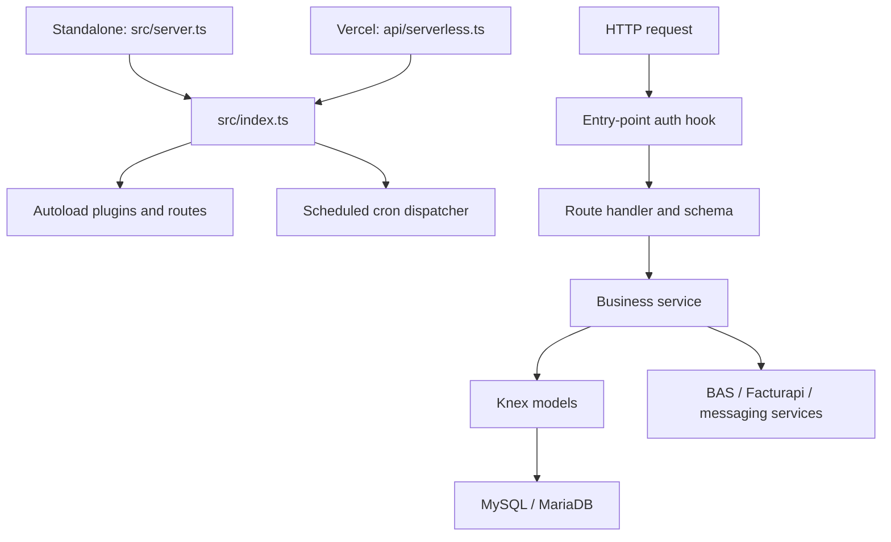

# BOS repository map

## Public order invoicing (2026-10-06)

- `src/routes/public/orders/index.ts`: GET `/public/orders/:uuid/invoices.zip`, `config.auth.public`, UUID v4 parameter, no automatic HEAD handler, no-store/robots/referrer headers. No BAS session required: possession of the random UUID grants access and may trigger issuance.
- `migrations/20261006000000_addPublicOrderUuid.ts`: nullable unique `orders.public_uuid` and nullable `public_billing_attempted_at`. **No backfill**. Apply before deploying the changed order queries; historical orders remain unavailable through this URL.
- `OrdersService.addOrder` generates `crypto.randomUUID()` for new orders and returns `data.publicUuid`; `OrderModel` includes publicUuid in authenticated list/detail queries. New requested orders also receive a UUID, but cannot issue until paid. POS need not change to keep creating orders.
- `PublicOrderInvoiceService.download`: resolve UUID, reject unknown/deleted orders, collect legacy and linked billing records plus `orders.billed`, deduplicate provider IDs. Existing invoices download regardless of current paid/RFC state. If none exist, require status `paid`, non-generic RFC with valid local structure/calendar date, name/email/postal code/tax system, and a defined payment form (not 99); call existing BillingService.addInvoice with PUE. Provider performs final fiscal validation. Local validation does not assert SAT registration; default generic RFCs are intentionally ineligible for public issuance.
- `PublicOrderBillingModel.claim`: atomic conditional update of an unbilled, paid, nondeleted order with no previous attempt. Prevents concurrent public requests across workers from issuing twice. A provider/persistence failure retains the attempt marker: response 502, later attempts without recorded invoices get 409. Operator must reconcile provider issuance and local records before clearing a marker; never automatically reset it on timeout. Other authenticated invoice creation paths do not use this public claim.
- ZIP assembly downloads PDF and XML through FacturaApiService, puts each pair under `factura-N/`, and uses `fflate`. Entire response is prepared before attachment headers; failed downloads return JSON 502, with no partial ZIP and no reissuance on retry. Aggregate source files capped at 50 MiB in memory.
- Statuses: 400 malformed UUID; 404 missing/old/deleted order; 409 unpaid, concurrent, changed, or unresolved issuance; 422 invalid/incomplete fiscal data or payment form; 502 issuance/download failure. Example: `GET /public/orders/<data.publicUuid>/invoices.zip`.
- Tests: `__tests__/services/public-order-invoices.test.ts` and `__tests__/integrations/public-order-invoices.test.ts` use mocks, real ZIP decoding and Fastify injection (29 passing); `__tests__/services/public-order-claim.test.ts` checks MySQL claim/lookup SQL without connecting to a DB. New source/test/migration lint passed. TypeScript fixes cover the serverless close hook, payment-complement date/fixture, unused import and bcrypt declarations. Local UUID migration was applied by the user. Shared architecture: `../projects_overview.md`.

Inspected: 2026-09-23. This map describes the current working tree, including existing uncommitted billing/order changes. Architecture findings come from static source inspection. Subsequently, 40 Jest route contract tests were added/updated and passed; application startup, live integrations, and migrations were not executed. Secret values in `.env` and database contents were not inspected.

## Purpose and stack

BOS is a business operations API covering sales orders, payments, customers, products, materials, inventory, invoicing, suppliers, debts, employees, and payroll. This repository contains the backend; no frontend application was found.

- TypeScript 5.6, Fastify 5, and filesystem-based route loading through `@fastify/autoload`.
- Knex 3 with the `mysql` driver; local Docker configuration uses MariaDB 10.6.
- Yarn 4.7.0 with the `node-modules` linker. `package.json` declares Node 20; `.nvmrc` uses the moving `lts/*` selector.
- BAS for identity/company roles, Facturapi for invoicing, Nodemailer for email, and Meta Graph API for WhatsApp.
- Jest, ts-jest, and Supertest for the current test entry point.

## Directory guide

| Location | Responsibility |
| --- | --- |
| [src/server.ts](src/server.ts) | Standalone Fastify startup, authentication/authorization hooks, route collection, error auditing, graceful shutdown, and listening socket. |
| [src/index.ts](src/index.ts) | Shared application plugin: autoloads plugins/routes and registers scheduled work. |
| [api/serverless.ts](api/serverless.ts) | Separate Vercel entry point with its own Fastify instance and duplicated server hooks. |
| [src/routes](src/routes) | HTTP handlers, route schemas, and per-route authorization metadata. |
| [src/services](src/services) | Business workflows and adapters to external systems. |
| [src/models](src/models) | Knex queries and database-oriented interfaces. These are query wrappers, not ORM entities. |
| [src/plugins](src/plugins) | Environment loading, CORS, Helmet, and multipart registration. |
| [src/config](src/config) | Main Knex connection export and in-memory route registry. |
| [src/common/config.ts](src/common/config.ts) | SMTP settings plus an additional database configuration definition. |
| [src/schemas](src/schemas), [src/types](src/types) | JSON request schemas, corresponding declaration files, and integration types. Many routes also define schemas inline. |
| [src/templates](src/templates), [src/utils](src/utils) | Email/WhatsApp templates, rendering/sending helpers, object key conversion, and general utilities. |
| [migrations](migrations) | Timestamped Knex schema changes from 2023 through 2026, plus SQL examples. |
| [seeds](seeds) | `init.ts` executes the bundled `sql/init.sql` through Knex. |
| [__tests__](__tests__) | Jest route contract suites for core endpoints and health; see the [testing guide](__tests__/README.md). |
| `db/`, `coverage/`, `node_modules/` | Local database storage, generated coverage, and installed dependencies; excluded from the source map. |

## Startup and request flow

The standalone server loads `.env`, initializes the legacy `Db` singleton, registers the shared app, and listens on `SERVER_HOSTNAME` and `PORT` (defaults: `127.0.0.1:3000`). Models inspected use the separate `db` export from [src/config/db.ts](src/config/db.ts), which chooses a [knexfile.ts](knexfile.ts) configuration using `NODE_ENV`, defaulting to `development`.

The authentication hook skips routes only when `config.auth.public` is set. Otherwise it requires an Authorization header, constructs `MeService`, checks token expiry, and retrieves cached or remote BAS user details. Routes with role metadata allow any listed role, with an admin bypass. Routes without role metadata still require authentication. `MeService` decodes JWTs locally; it does not locally verify their signatures. BAS supplies user/company validation on cache misses.

`GET /` returns collected route definitions, excluding HEAD and OPTIONS. `GET /health/check` returns `{ status: true }`; neither is marked public. [src/swagger.ts](src/swagger.ts) defines a Swagger initializer, but no invocation was found in the startup paths, so `/documentation` should not be assumed available.

## Domain and route map

Prefixes below follow the autoload directory layout. `_orderId`, `_clientId`, `_id`, and `_facturaApiId` folders become route parameters because `routeParams: true` is enabled. Filenames alone do not define endpoint suffixes; check each handler's `url`.

| Route area | Main implementation | Scope |
| --- | --- | --- |
| `/orders`, `/requested` | [OrdersService.ts](src/services/orders/OrdersService.ts) | Order creation, requested orders, totals, status, cancellation, payment handling, and inventory deductions. |
| `/orders/:orderId/payments`, `/orders/:orderId/billing` | [Order subroutes](src/routes/orders/_orderId) | Order-specific payment records and billing lookup. Billing route is an existing untracked working-tree addition. |
| `/payments` | [PaymentsServices.ts](src/services/payments/PaymentsServices.ts) | Payment records and operations. |
| `/clients`, `/clients/me`, `/clients/:clientId/*` | [ClientService.ts](src/services/clients/ClientService.ts) | Customer records, validation, summaries, debt, and BAS-linked identity. |
| `/products`, `/products/:id/inventory`, `/process` | [ProductService.ts](src/services/products/ProductService.ts) | Catalog, recipes/material requirements, product inventory, and production process entries. |
| `/materials`, `/inventory` | [Materials services](src/services/Materials), [inventory service](src/services/inventory) | Materials, pricing, and stock movements. Preserve the capital `Materials` directory in imports. |
| `/billing`, `/billing/:facturaApiId`, `/billing/metadata` | [BillingService.ts](src/services/billing/BillingService.ts), [FacturaApiService.ts](src/services/billing/FacturaApiService.ts) | Invoices, cancellation, downloads, custom invoices, payment complements, requests, and billing metadata. |
| `/providers`, `/debts` | [providerService.ts](src/services/providers/providerService.ts), [debtService.ts](src/services/debts/debtService.ts) | Suppliers and debt records. |
| `/middleman`, `/middleman/me` | [MiddlemanService.ts](src/services/middleman/MiddlemanService.ts) | Intermediaries, client links, and commissions. |
| `/employees`, `/payroll` | [employees service](src/services/employees), [PayrollService.ts](src/services/payroll/PayrollService.ts) | Employees, paid time off, payroll, and payroll payments. |
| `/auth`, `/users`, `/notifications` | [BAS adapter](src/services/users/basService.ts), [notification routes](src/routes/notifications/index.ts) | Authentication, company users, password changes, notifications, and device registration. |
| `/info` | [StatsService.ts](src/services/stats/StatsService.ts), [Siapa.ts](src/services/billing/Siapa.ts) | Summary statistics, expired orders, and SIAPA utility information. |
| `/cron` | [CronService](src/services/crons/index.ts) | Stored job definitions, executable-job inspection, and explicit execution. |
| `/types`, `/example` | [types route](src/routes/types/index.ts), [example route](src/routes/example/index.ts) | `/types` currently returns products despite its name; `/example` is a starter route. |

## Data model and business connections

These are logical relationships read from queries and migrations, not a claim that all are enforced by foreign keys.

| Tables | Relationship / use |
| --- | --- |
| `clients`, `orders`, `items`, `products` | Orders reference customers; items connect orders to products with quantity and price. |
| `materials`, `recipes`, `products` | Recipes connect products to materials and required quantities. |
| `inventory` | Signed quantity movements keyed by `external_id` and `type`, supporting product/material stock. |
| `payments` | General payment ledger using `external_id`, `payment_type`, and `flow`; order payment queries filter all three. Includes customer and billing references. |
| `billing`, `metadata_billing`, `apiKeys`, `billableServices` | Local invoice references/status, imported metadata, integration keys, and billable service records. |
| `providers`, `bank_details`, `materials_price_list` | Supplier, banking, and material price data. |
| `middleman`, `link` | Intermediaries and their linked customers. |
| `employees`, `pto`, `payroll` | Employee records, leave requests, and payroll entries. |
| `process`, `debts`, `cronjobs`, `audit` | Production activity, debts, scheduled jobs, and recorded errors. |

[objectFormat.ts](src/utils/objectFormat.ts) provides camelCase/snake_case conversion at database boundaries. Models also alias selected database columns explicitly.

Order creation is a useful starting point for understanding cross-domain behavior: `OrderService.addOrder` calculates item prices and totals, inserts the order and items, initiates a payment insert, and writes negative inventory movements. These calls do not share one service-level transaction, and the payment insert is not awaited in that method. Failure can therefore leave partial workflow state. Billing and order services also import each other, so changes in either deserve cross-domain review.

## Integrations, configuration, and background work

| Configuration names | Consumer / purpose |
| --- | --- |
| `NODE_ENV`, `PORT`, `SERVER_HOSTNAME` | Runtime environment, database profile, logging, and listen address. |
| `DB_DATABASE`, `DB_USERNAME`, `DB_PASSWORD`, `DB_HOST` | Main development/production Knex connection and legacy `Db` singleton. |
| `BAS_URL`, `BAS_COMPANY`, `BAS_SUPER_ADMIN_TOKEN` | BAS identity, company membership, user administration, and notifications. |
| `FACTURAPI_KEY` | Default credential for the Facturapi adapter. |
| `SMTP_HOST`, `SMTP_PORT`, `SMTP_USER`, `SMTP_PASSWORD` | Nodemailer transport in `MailService`. |
| `MAIL_URL` | HTTP mail adapter in `src/services/mail/Nots.ts`. |
| `WS_TOKEN`, `WS_FROM` | WhatsApp adapter in `src/services/notifications/wsService.ts`. |
| `CLIENT_URL`, `COMPANY_EMAIL` | Notification template links/contact data. |

Only `PORT` appears in the environment plugin's schema; it does not validate the full integration configuration. The main database configurations do not consume the README's `DB_CONNECTION` or `DB_PORT`. `src/common/config.ts` separately uses `DB_USER` and `DB_NAME`, which differ from the main connection names.

`src/index.ts` sets `America/Mexico_City` as the process timezone and schedules `* * 10 * * *`: every second during the 10 AM hour. The dispatcher examines database schedules and `executed_at` to identify due jobs. [SettledCronService.ts](src/services/crons/SettledCronService.ts) registers weekly summary emails, expired invoice cancellation, and payment reminders. Scheduling is registered by the shared app, including the serverless path; runtime behavior and concurrency were not tested.

## Development and deployment commands

Commands below are declared in the repository. Typecheck and the full Jest suite were verified on 2026-10-06; deployment migration execution was tested with mocks only.

| Command | Actual behavior / prerequisite |
| --- | --- |
| `yarn install` | Installs dependencies using the pinned Yarn release. |
| `yarn dev` | Runs `tsx watch src/server.ts`. Requires configured database/integrations for relevant routes. |
| `yarn local` | Runs `dev.sh`: starts the Docker database, exports local DB settings, runs migrations, then starts development mode. Requires a POSIX shell. |
| `yarn knex migrate:latest` | Migration invocation used in `dev.sh`; changes the selected database. |
| `yarn typecheck` | Runs `tsc --noEmit --incremental false`, including deployment scripts. |
| `yarn lint` | Runs ESLint with `--fix`, so it can modify source files. |
| `yarn format` | Formats `src/**/*.ts` and `test/**/*.ts`; the latter differs from the actual `__tests__` directory. |
| `yarn test` | Runs Jest using `jest.config.ts`, with coverage, mocked services, and no database reset. |
| `yarn vercel` | Starts Vercel development mode; `vercel.json` rewrites requests to `api/serverless.ts`. |

## Confirmed maintenance findings

1. **Test setup was made independent of the database.** The original [jest.setup.ts](jest.setup.ts) truncated schema `bos` and ran seeds. That behavior has been removed. The current 40 tests exercise core HTTP routes with mocked services using Fastify injection. They do not establish database correctness, service business-logic correctness, or production authorization coverage.
2. **Setup documentation has drifted.** The README describes Cucumber and `yarn migrate`, but `yarn test` invokes Jest and there is no `migrate` script. It documents port 8000 while standalone startup defaults to 3000. `test.sh` still targets absent `features/**/*.ts` files and uses `fkill`, which is not declared in `package.json`.
3. **Container startup needs reconciliation.** [Dockerfile](Dockerfile) uses Node 18 and runs `yarn build`, but `package.json` declares Node 20 and has no `build` script. Compose's app service sets `DB_USER`/`DB_NAME`, whereas the main connection expects `DB_USERNAME`/`DB_DATABASE`.
4. **Database configuration is duplicated.** `src/config/db.ts`/`knexfile.ts`, `src/db.ts`, and `src/common/config.ts` define different connection paths/settings. Most inspected models use the first; startup still initializes the second. The staging Knex profile contains PostgreSQL placeholder settings while the declared database driver is MySQL.
5. **Entry points can diverge.** Standalone and serverless startup duplicate authentication and lifecycle logic. The standalone entry explicitly registers `ErrorModel.addError` on `onError`; the serverless entry does not.
6. **Background dispatch deserves review.** The six-field cron expression runs every second for an hour, rather than once per day. No overlap guard is visible in the dispatcher, and the reminder handler starts `Promise.all` without awaiting it before returning.
7. **Working-tree schema changes matter.** The existing untracked [billing migration](migrations/20251128221417_addTypeToBilling.ts) adds `type` and `folio`; current billing code includes these fields. Verify code/schema alignment when deploying those changes. No existing source edits were altered while producing this map.

## Where to start a change

- **Endpoint behavior:** locate the route under `src/routes`, inspect its schema and `config.auth`, follow the service, then its models and migrations.
- **Order/payment correctness:** begin with `OrdersService.ts`, `PaymentsServices.ts`, and the corresponding models; trace inventory and billing effects as well as the immediate response.
- **Invoice integration:** begin with `BillingService.ts` and `FacturaApiService.ts`, then billing routes, local billing records, and notification helpers.
- **Schema changes:** add a timestamped Knex migration and update model/service types and mappings together.
- **Startup/configuration issues:** compare both entry points, the autoload plugin, `knexfile.ts`, and deployment files before relying on README instructions.

Validation (2026-10-06): `yarn typecheck` passed; all 15 Jest suites / 87 tests passed with `--runInBand --coverage=false`; deployment runner and its tests passed ESLint. No remote deployment, real migration run, live runtime health or external service availability was verified by the agent. The user reports the UUID migration applied locally.

## Vercel migration workflow

- `vercel.json` invokes `yarn vercel-build`: typecheck then `yarn migrate:deploy`. `scripts/migrate-deploy.ts` runs pending TypeScript migrations using the production Knex profile and closes the connection. Failures block deployment; no seeds run.
- Configure DB_HOST, DB_DATABASE, DB_USERNAME and DB_PASSWORD for each Vercel environment. Preview must use an isolated database. Knex tracks applied migrations and locks concurrent runners. See `DEPLOYMENT.md` for permissions, failure recovery and schema compatibility requirements.
- `__tests__/services/deployment-migrations.test.ts` tests configuration, no-op runs, cleanup and failure propagation with a mocked database.
